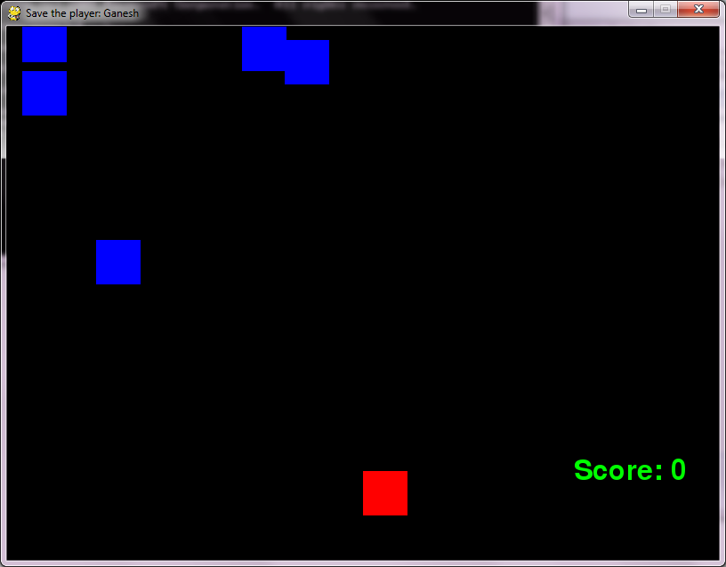

# Save the player

The rule is to save the player from obstacles falling down. The player must dodge the obstacles.

The more the player dodges the obstacles, more he scores.

If the player hits an obstacle, he loses.

1. save_playerV2.py: Used tkinter to display game over message in a message box
2. save_playerV3.py: Used SQL connector, to store score in database.

